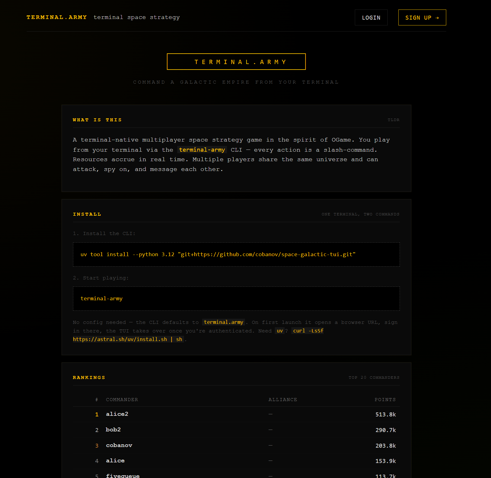

# terminal.army

> A multiplayer space strategy game you play from your terminal.

[](https://terminal.army)

<!-- ⬇ replace this with your own banner / hero screenshot -->


---

## What is this

`terminal.army` is a love letter to **[OGame](https://ogame.fandom.com/wiki/OGame_Wiki)** — the legendary browser-based space-strategy game from the early 2000s — rewritten in Python and played entirely through your terminal.

Build mines, research technology, train fleets, raid your friends, scout
the galaxy with espionage probes, found alliances. Resources accrue in
real time. Multiple players share the same universe.

Everything happens inside the terminal: there is no game client to
download beyond a single Python package, no Flash, no JavaScript-heavy
game UI. Slash commands all the way down.

**It's completely free.** It's a fun project — I wanted to write OGame
in Python and see how playable a pure-terminal version of it would be.
The answer turned out to be: very.

---

## Install + play (2 commands)

```bash
# 1) Install uv if you don't have it
curl -LsSf https://astral.sh/uv/install.sh | sh

# 2) Install + run the client
uv tool install --python 3.12 "git+https://github.com/cobanov/space-galactic-tui.git"
tarmy
```

On first launch it opens a browser URL for you to sign up at
[terminal.army](https://terminal.army). Confirm the signup, return to
the terminal — the TUI takes over.

No further config needed. The CLI defaults to `https://terminal.army`.

### Updating

```bash
tarmy --update
```

Pulls the latest version from github and reinstalls in-place. Re-run
`tarmy` after it finishes.

<!-- ⬇ screenshot of the login / signup flow -->


---

## What it looks like

<!-- ⬇ main dashboard: planet card on top, log + input in the middle, status panel on the right -->


The screen has three columns:

- **Left** — categorised command palette (PLANET, RESEARCH, FLEET, GALAXY, SOCIAL, STANDINGS, HELP)
- **Middle** — the current planet card on top, slash-command log + prompt below
- **Right** — your planets list, active build queues, fleet missions, current onboarding quest, unread mail

<!-- ⬇ /galaxy modal: arrow keys page through systems & galaxies -->


<!-- ⬇ /research with the tech tree + costs -->


---

## How you play

You type slash commands. `/help` lists them all. The autocomplete
popup suggests the next argument as soon as you press space.

A handful of the most common:

| command | what it does |
| --- | --- |
| `/planet` | full read-out of the current planet (resources, energy, queue) |
| `/upgrade metal_mine` | build / upgrade a structure (also `/upgrade research_lab`, `/upgrade shipyard` …) |
| `/research energy` | research a technology |
| `/ships build small_cargo 5` | queue ship production |
| `/defense build rocket_launcher 10` | queue defense structures |
| `/attack 4:128:6` | send an attack fleet (opens a ship picker if you don't pass counts) |
| `/transport 4:128:6 m=10000` | move metal to a friend |
| `/espionage 4:128:6` | scout a target with espionage probes |
| `/galaxy` | open the galaxy map; ← → page systems, ↑ ↓ page galaxies |
| `/msg cobanov hello` | message another commander |
| `/alliance` | view your alliance roster (management lives on the web dashboard) |
| `/quest` | onboarding objectives — your next milestone is always one of these |
| `/info crawler` | encyclopedia entry for a building / tech / ship / defense |
| `/switch 2` / `/switch CODE` / `/switch Colony` | jump to another of your planets |

Most things have short aliases — `/u`, `/r`, `/s`, `/atk`, `/spy`, `/tx`, `/lb`, etc.

<!-- ⬇ a few command outputs side-by-side -->


---

## Theme it

```text
/options --theme dracula
/options --theme catppuccin-mocha
/options --theme sakusen-dark   (default)
```

Your choice is saved next to your auth token and applied on every launch.

---

## Inspired by, not affiliated with

This is a fan project inspired by OGame. All formulas (mine production,
research costs, fleet speeds, espionage info levels, combat) are taken
from the [OGame Fandom Wiki](https://ogame.fandom.com/wiki/Formulas).
The look-and-feel and game flow are intentional homage. OGame and all
related trademarks belong to their respective owners (Gameforge); this
project is **not** affiliated with or endorsed by them.

Free, no ads, no premium currency, no pay-to-win. If the server is up
and you can install Python 3.12, you can play.

---

## Issues / feature requests

Open an issue at
[github.com/cobanov/space-galactic-tui/issues](https://github.com/cobanov/space-galactic-tui/issues).
